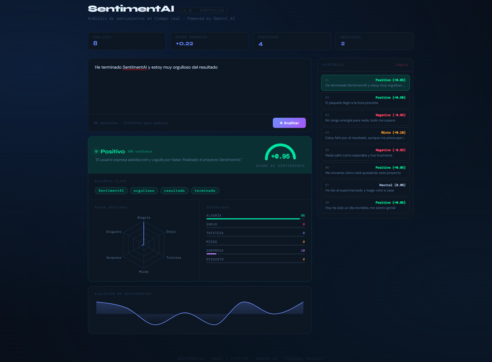

# SentimentAI


Aplicación full-stack para análisis de sentimientos utilizando FastAPI, React y Google Gemini.

El usuario introduce un texto y la aplicación genera un análisis estructurado que incluye:

* Sentimiento general
* Score de polaridad
* Nivel de confianza
* Distribución emocional
* Palabras clave relevantes
* Resumen generado por IA


## 📸 Preview




## ✨ Características

- Análisis de sentimiento en tiempo real
- Radar emocional con Recharts
- Historial interactivo
- Atajos de teclado (Ctrl+Enter)
- UI responsive
- Backend tipado con Pydantic
- Integración con Google Gemini


## 🚀 Tecnologías

### Backend

* FastAPI
* Uvicorn
* Google Gemini API
* Pydantic
* Python Dotenv

### Frontend

* React
* TypeScript
* Vite
* Recharts
* CSS


## 📂 Estructura del proyecto

```text
sentimentai/
│
├── backend/
│   ├── app/
│   │   ├── api/
│   │   ├── clients/
│   │   ├── core/
│   │   ├── prompts/
│   │   ├── schemas/
│   │   ├── services/
│   │   └── main.py
│   │
│   └── requirements.txt
│
├── frontend/
│   ├── src/
│   │   ├── components/
│   │   ├── constants/
│   │   ├── hooks/
│   │   ├── pages/
│   │   ├── services/
│   │   ├── styles/
│   │   ├── types/
│   │   ├── App.tsx
│   │   └── main.tsx
│   │
│   └── package.json
│
└── README.md
```


## ⚙️ Instalación

### 1. Clonar el repositorio

```bash
git clone <url-del-repositorio>
cd sentimentai
```


## ▶️ Backend

Entrar en la carpeta:

```bash
cd backend
```

Crear entorno virtual:

```bash
python3 -m venv .venv
```

Activar entorno (Linux / WSL):

```bash
source .venv/bin/activate
```

Instalar dependencias:

```bash
pip install -r requirements.txt
```

Crear archivo `.env`:

```env
GEMINI_API_KEY=tu_api_key
```

Ejecutar servidor:

```bash
uvicorn app.main:app --reload
```

Backend disponible en:

```text
http://localhost:8000
```

Swagger:

```text
http://localhost:8000/docs
```


## ▶️ Frontend

Entrar en la carpeta:

```bash
cd frontend
```

Instalar dependencias:

```bash
npm install
```

Crear archivo `.env`:

```env
VITE_API_URL=http://localhost:8000
```

Ejecutar:

```bash
npm run dev
```

Frontend disponible en:

```text
http://localhost:5173
```


## 📡 API

### POST `/api/v1/analyze`

Request:

```json
{
  "text": "Hoy ha sido un día increíble"
}
```

Response:

```json
{
  "sentiment": "positive",
  "score": 0.91,
  "confidence": 0.97,
  "emotions": {
    "joy": 88,
    "anger": 2,
    "sadness": 1,
    "fear": 3,
    "surprise": 25,
    "disgust": 1
  },
  "keywords": [
    "increíble",
    "día"
  ],
  "summary": "El texto expresa una emoción claramente positiva."
}
```


## 🎯 Objetivos del proyecto

Proyecto personal desarrollado para profundizar en:

* Arquitectura Full Stack
* FastAPI
* React + TypeScript
* Integración con modelos LLM
* Diseño de APIs tipadas con Pydantic
* Gestión de estado mediante Custom Hooks
* Buenas prácticas de organización de código